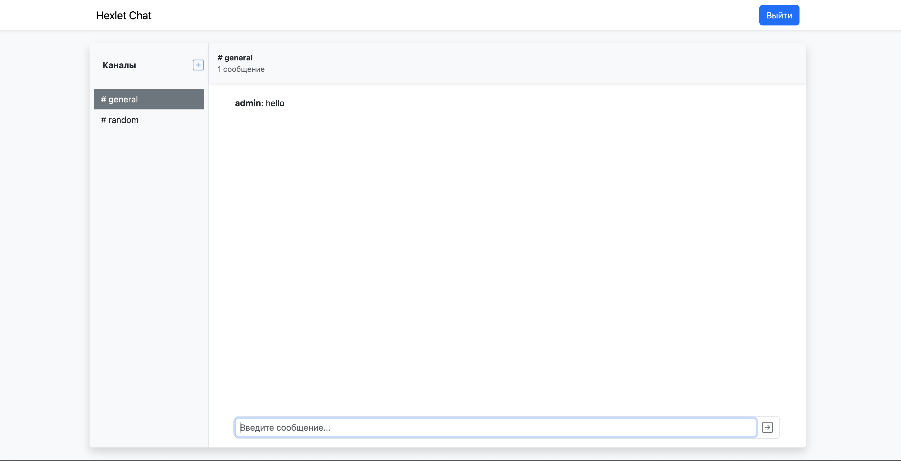
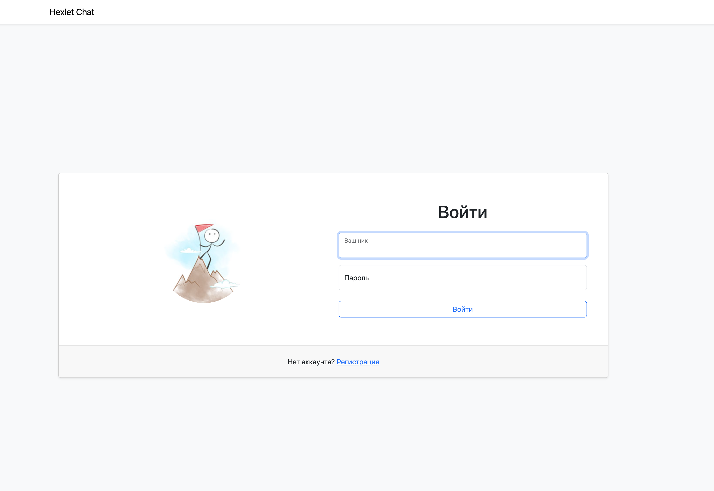
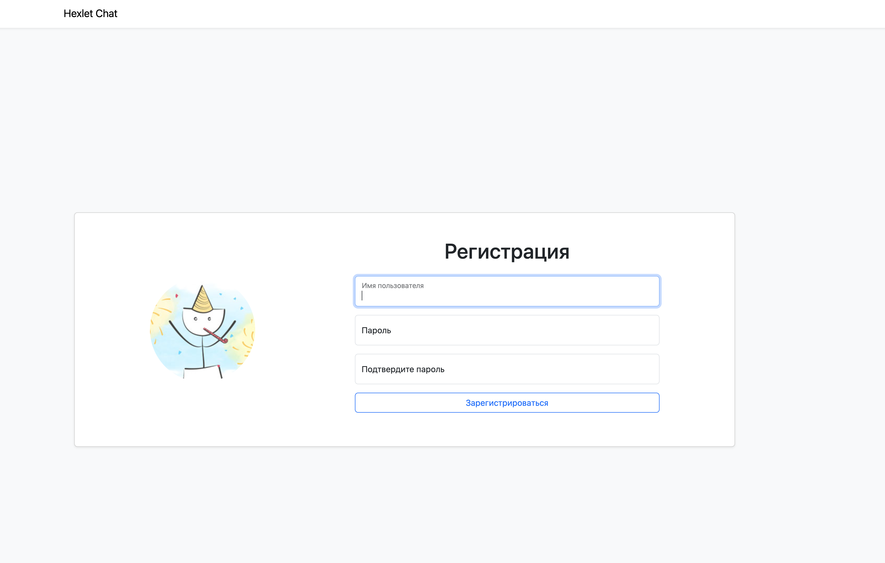

### Hexlet tests and linter status:
[](https://github.com/SageUniverse95/frontend-project-12/actions)

# Chat App

This is a simplified slack application implemented with React.

### About

The application has the following functionality:

* Create/delete/rename/channels (CRUD)
* Sending messages (socket io)
* Registration of new users


### Preview







#### Usage

```
npm postinstall
```


[Welcome to App](https://frontend-project-12-production-5c14.up.railway.app/login)